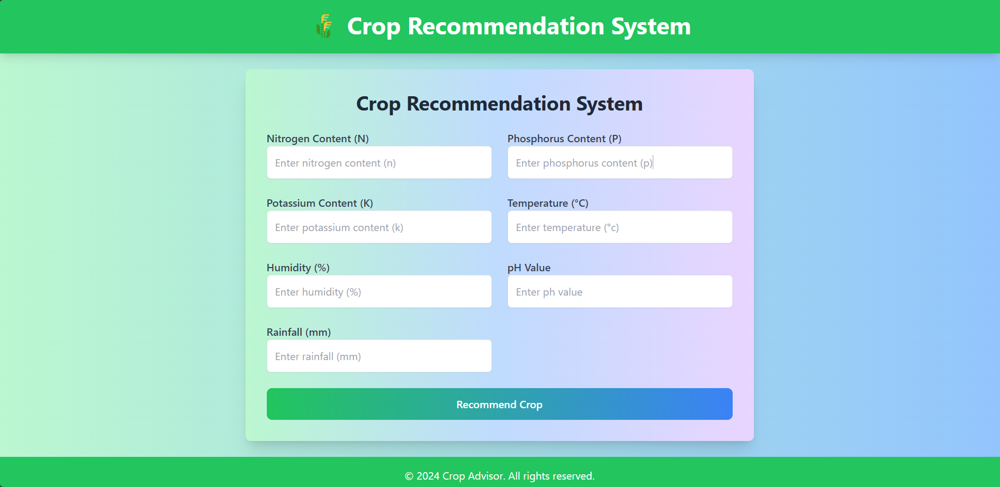
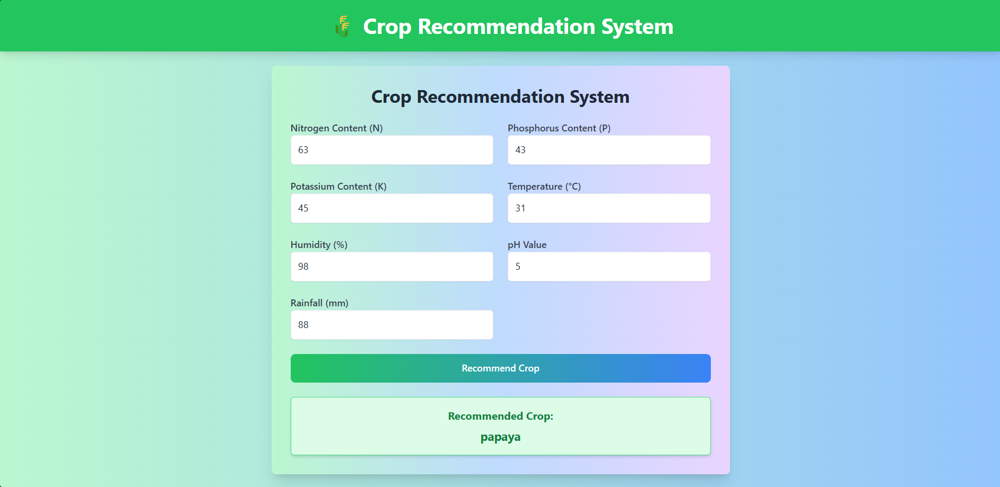

# AgroAdvisor 🌾

**AgroAdvisor** is a machine learning-based crop recommendation system that suggests the best crops to grow based on soil properties and environmental conditions. This project leverages a user-friendly interface and a robust backend to help farmers make informed decisions.

---

## 🌟 Features

- **Input Soil Properties**: Users can input nitrogen (N), phosphorus (P), potassium (K), temperature, humidity, pH, and rainfall values.
- **Crop Recommendation**: The system suggests the most suitable crop for the given soil and environmental conditions.
- **Modern Frontend**: A colorful and intuitive interface built with React and Tailwind CSS.
- **Machine Learning Integration**: Predictive analysis powered by a trained machine learning model.
- **RESTful API**: A Node.js backend provides seamless communication with the frontend.

---

## 🚀 Technologies Used

### Backend:
- **Node.js** with Express.js
- **Python** for the ML model
- **Flask** for ML model integration
- **Axios** for API communication

### Frontend:
- **React** (via Vite)  
- **Tailwind CSS** for styling  
- **Axios** for API calls  

---

## **Steps to Run**:  


#### 1. Clone the repository  
```bash  
git clone https://github.com/yogendrabaskota/AgroAdvisor.git  
```

## To Run Backend Server

```https 
cd backend
```

- To install required packages
```https 
  npm install
``` 
- To run server
```https 
  npm start
``` 

## To Run Frontend

```https 
cd frontend
``` 
- To install required packages 

```https 
  npm install
``` 

- To run project

```https 
  npm run dev
``` 

### Note:
- Don't forget to update the API path in the frontend if needed.

### To get API documentation, click [Here](https://documenter.getpostman.com/view/33322053/2sAYBbeUTa)


## Output :




## Feedback
  If you have any feedback, please reach out to me at yogendrabaskota18@gmail.com  


### To get API documentation, click [Here](https://documenter.getpostman.com/view/33322053/2sAYHwJjgs)

